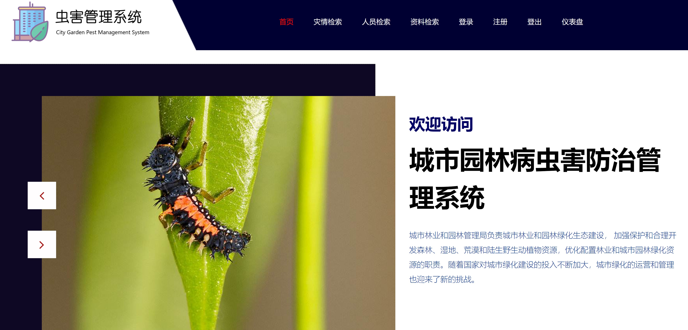

# 城市园林病虫害防治管理系统 
City Garden Pest Management System

#### 介绍 Introduction
城市园林病虫害防治管理系统（City Garden Pest Management System）“是为城市林业和园林管理局用于维护和管理园林业务而设计，其目的是为了通过互联网技术缩短此项业务的运营和管理成本，提升经济效益。另一方面，也为绿化业务管理人员提供快捷、方便的操作平台

The City Garden Pest Management System is designed for the maintenance and management of the garden business by the Urban Forestry and Garden Administration. Its purpose is to shorten the operation and management costs of this business through Internet technology and increase Economic benefits. On the other hand, it also provides a fast and convenient operation platform for greening business managers

#### DEMO

#### 软件架构 Architecture

SSM

